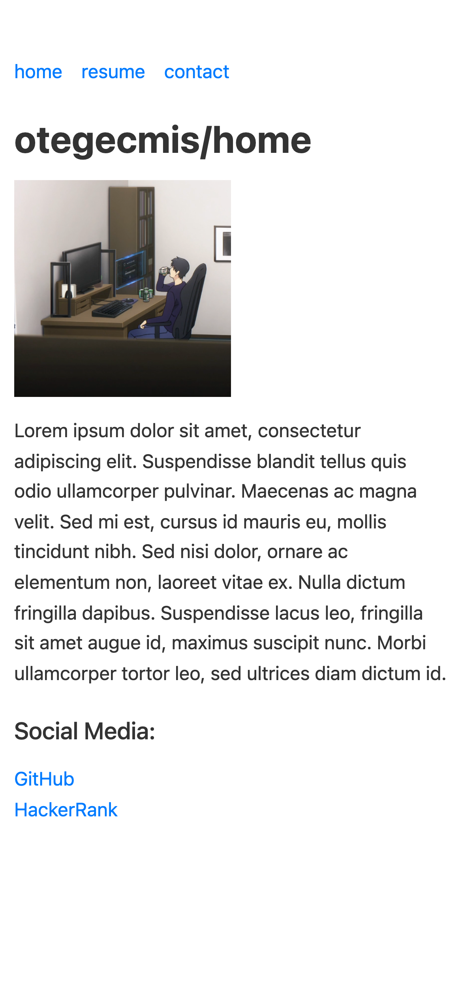
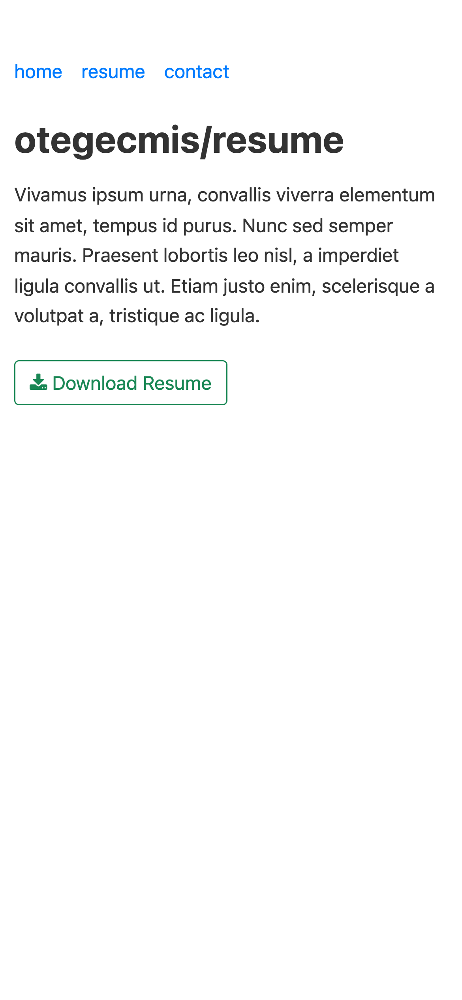
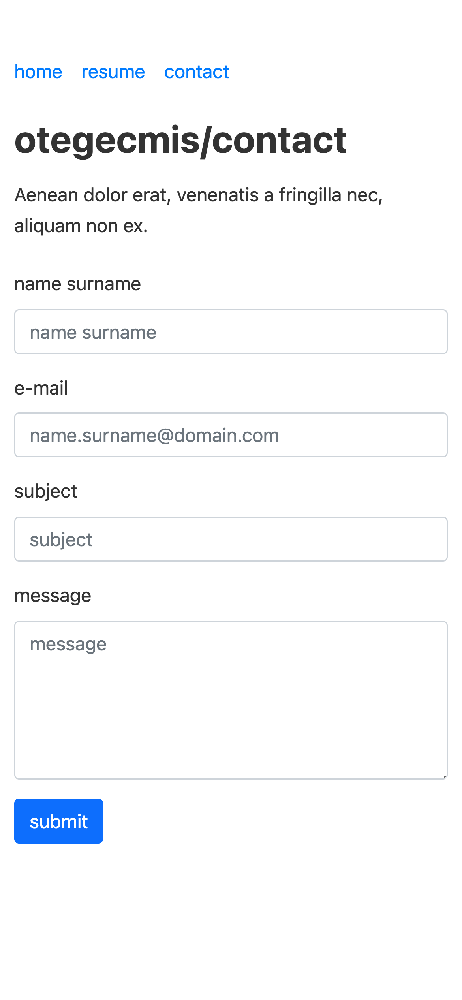

## Personal Page Starter

This project is a `starter template for a personal website` built using `.NET MVC 7`.

### Screenshots

<div style="float: left;">
    
    
    
</div>

**Note:** The following screenshots display the mobile responsive views of the website.

### Installation

To install and run the project, follow these steps:

1. Clone the repository to your local machine.

```sh
    git clone https://github.com/otegecmis/personal-page-starter.git
```

2. Navigate to the project directory.

```sh
    cd personal-page-starter
```

3. Run the project using the .NET CLI.

```sh
    dotnet run
```
